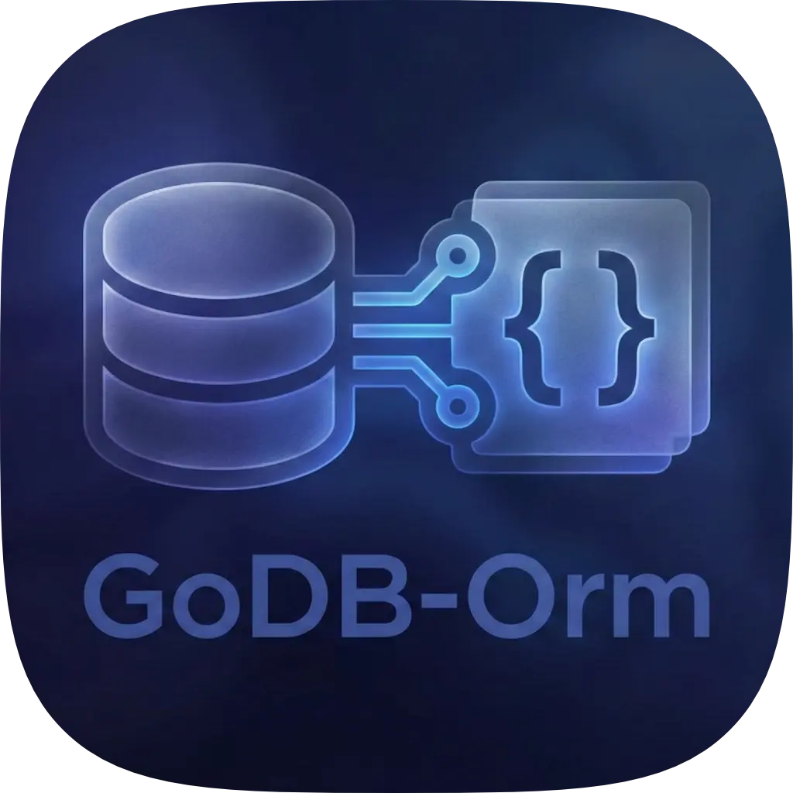
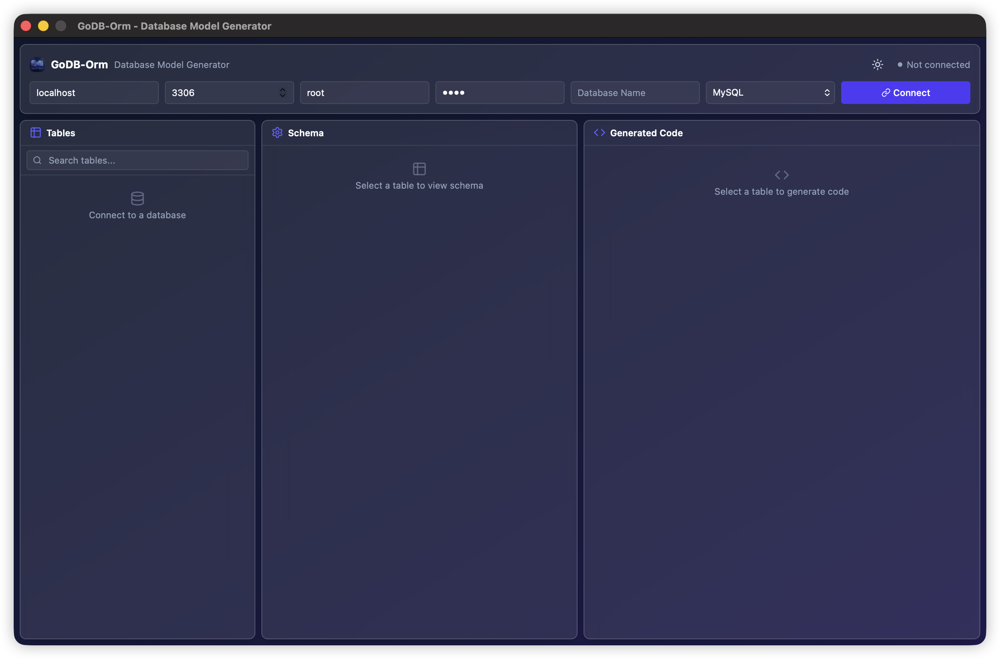
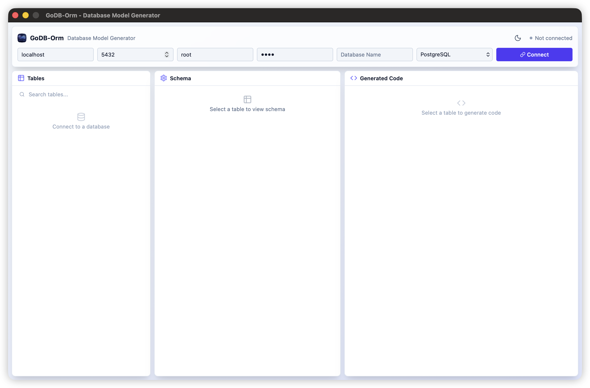

# GoDB-Orm

<p align="center">
  
</p>

<p align="center">
  <strong>Database Model Generator for Go/GORM</strong>
</p>

<p align="center">
  Generate Go ORM structs from your database tables with a beautiful GUI or CLI
</p>

<p align="center">
  
  
  
  
  
</p>

---

## ✨ Features

- 🖥️ **Modern GUI** - Beautiful desktop application built with Wails v2 + Vue 3
- 🌓 **Dark/Light Theme** - Toggle between dark and light themes
- 🐬 **MySQL Support** - Full MySQL/MariaDB database introspection
- 🐘 **PostgreSQL Support** - Full PostgreSQL with schema selection
- 🏷️ **GORM Tags** - Auto-generated GORM struct tags with type mapping
- 📝 **Smart Type Mapping** - Intelligent database-to-Go type conversion
- 💾 **Export Models** - Save individual or all models to files
- 🔧 **CLI Mode** - Command-line interface for automation
- 💡 **Live Preview** - Real-time code preview with syntax highlighting

## 📸 Screenshots

### Dark Theme


### Light Theme


## 🚀 Installation

### Prerequisites

- Go 1.23 or higher
- Node.js 18 or higher
- [Wails CLI](https://wails.io/docs/gettingstarted/installation)

### Build from Source

```bash
# Clone the repository
git clone https://github.com/rowjak/godb-orm.git
cd godb-orm

# Install Wails CLI (if not installed)
go install github.com/wailsapp/wails/v2/cmd/wails@latest

# Build the application
wails build

# The binary will be in build/bin/
```

### Development Mode

```bash
# Run in development mode with hot-reload
wails dev
```

## 📖 Usage

### GUI Mode

1. Launch the application
2. Enter your database connection details:
   - **Host**: Database host (e.g., `localhost`)
   - **Port**: Database port (MySQL: `3306`, PostgreSQL: `5432`)
   - **User**: Database username
   - **Password**: Database password
   - **Database**: Database name
   - **Driver**: Select `MySQL` or `PostgreSQL`
3. Click **Connect**
4. For PostgreSQL, select the desired **Schema**
5. Browse and select tables from the left panel
6. View the generated Go struct in the code preview panel
7. Click **Copy** to copy to clipboard or **Save** to export to file

### CLI Mode

```bash
# Generate models for all tables
godb-orm --host localhost --port 3306 --user root --db mydb --driver mysql

# Generate model for a specific table
godb-orm -H localhost -P 3306 -u root -d mydb --driver mysql --table users

# PostgreSQL with schema
godb-orm --host localhost --port 5432 --user postgres --db mydb --driver postgres --schema public
```

### Configuration

The application saves your connection settings to `~/.godb-orm/config.yaml` for convenience.

## 🏗️ Project Structure

```
godb-orm/
├── app.go                 # Main Wails application & bridge
├── main.go                # Entry point
├── wails.json             # Wails configuration
├── cmd/
│   └── root.go            # CLI commands (Cobra)
├── internal/
│   ├── config/            # Configuration management
│   ├── database/          # Database introspection
│   │   ├── models.go      # Data models
│   │   ├── connection.go  # Connection factory
│   │   ├── mysql_introspector.go
│   │   └── postgres_introspector.go
│   └── generator/         # Code generation
│       ├── generator.go   # Main generator
│       ├── tagbuilder.go  # GORM tag builder
│       ├── typemapper.go  # DB-to-Go type mapping
│       └── template.go    # Go struct template
├── frontend/              # Vue 3 frontend
│   ├── src/
│   │   ├── App.vue        # Main component
│   │   └── style.css      # Global styles & themes
│   └── public/
│       └── appicon.webp   # App icon
└── build/
    └── appicon.png        # Build assets
```

## 🔧 Supported Database Types

### MySQL/MariaDB

| MySQL Type | Go Type |
|------------|---------|
| `INT`, `INTEGER` | `int32` |
| `BIGINT` | `int64` |
| `SMALLINT` | `int16` |
| `TINYINT` | `int8` |
| `TINYINT(1)` | `bool` |
| `FLOAT` | `float32` |
| `DOUBLE`, `DECIMAL` | `float64` |
| `VARCHAR`, `TEXT` | `string` |
| `DATETIME`, `TIMESTAMP` | `time.Time` |
| `DATE` | `time.Time` |
| `JSON` | `datatypes.JSON` |
| `BLOB`, `BINARY` | `[]byte` |
| `ENUM` | `string` |

### PostgreSQL

| PostgreSQL Type | Go Type |
|-----------------|---------|
| `INTEGER`, `INT4` | `int32` |
| `BIGINT`, `INT8` | `int64` |
| `SMALLINT`, `INT2` | `int16` |
| `BOOLEAN` | `bool` |
| `REAL`, `FLOAT4` | `float32` |
| `DOUBLE PRECISION`, `FLOAT8` | `float64` |
| `NUMERIC`, `DECIMAL` | `float64` |
| `VARCHAR`, `TEXT` | `string` |
| `TIMESTAMP`, `TIMESTAMPTZ` | `time.Time` |
| `DATE` | `time.Time` |
| `UUID` | `uuid.UUID` |
| `JSON`, `JSONB` | `datatypes.JSON` |
| `BYTEA` | `[]byte` |
| `SERIAL`, `BIGSERIAL` | `int32`, `int64` |

## 📄 Example Output

```go
package models

import (
	"time"
)

// User represents the users table
type User struct {
	ID        int64     `gorm:"primaryKey;autoIncrement;column:id;type:bigint" json:"id"`
	Name      string    `gorm:"column:name;type:varchar(255);not null" json:"name"`
	Email     string    `gorm:"column:email;type:varchar(255);not null" json:"email"`
	Password  string    `gorm:"column:password;type:varchar(255);not null" json:"password"`
	CreatedAt time.Time `gorm:"column:created_at;type:timestamp" json:"created_at"`
	UpdatedAt time.Time `gorm:"column:updated_at;type:timestamp" json:"updated_at"`
}

// TableName returns the table name for GORM
func (User) TableName() string {
	return "users"
}
```

## 🤝 Contributing

Contributions are welcome! Please feel free to submit a Pull Request.

1. Fork the repository
2. Create your feature branch (`git checkout -b feature/amazing-feature`)
3. Commit your changes (`git commit -m 'Add some amazing feature'`)
4. Push to the branch (`git push origin feature/amazing-feature`)
5. Open a Pull Request

## 📝 License

This project is licensed under the Apache License 2.0 - see the [LICENSE](LICENSE) file for details.

## 👤 Author

**Abdur Rozaq**
- Email: rozaqabdur.rr@gmail.com
- GitHub: [@rowjak](https://github.com/rowjak)
